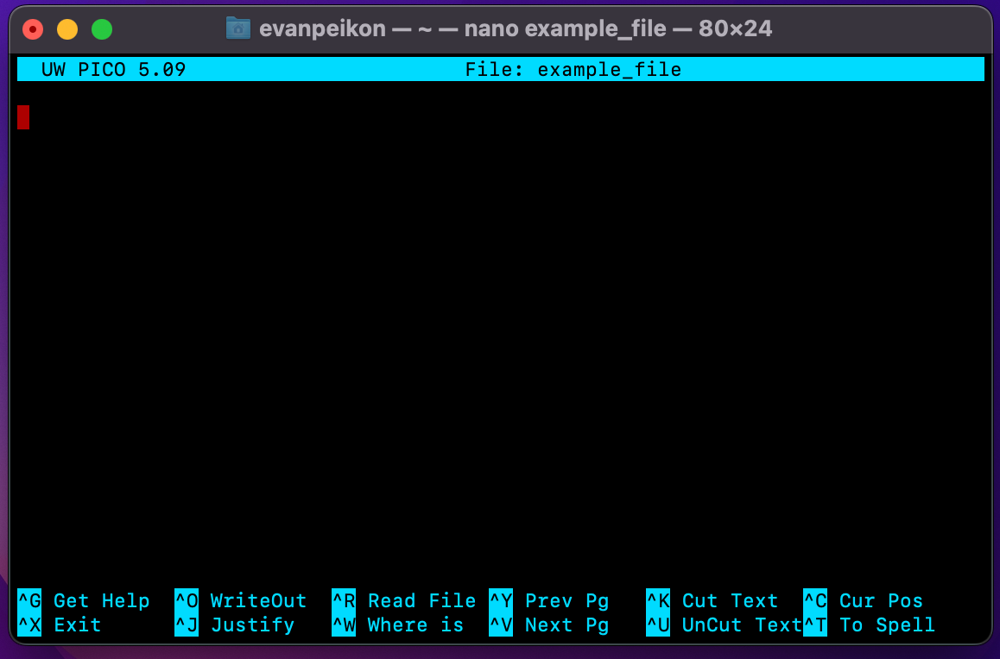
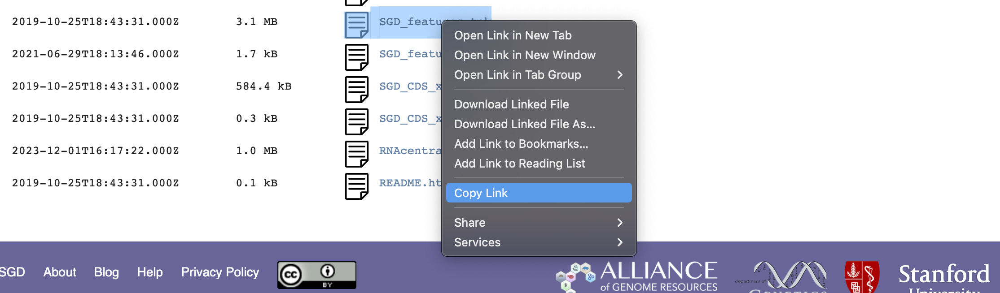
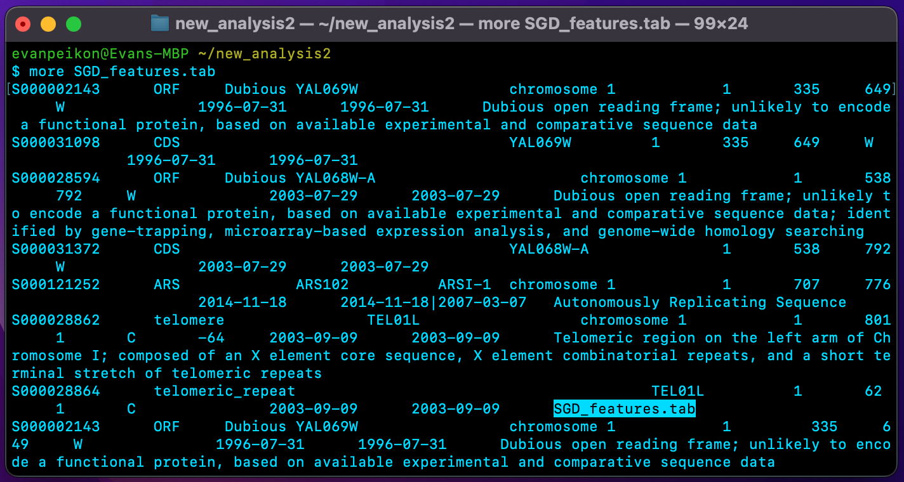
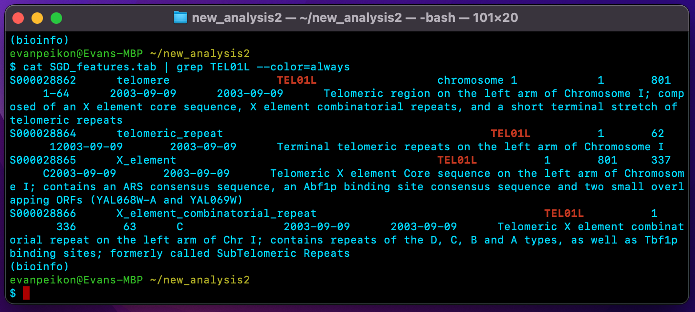

# 🦠 Bash Fundamentals For Bioinformatics 
Unix is a computer operating system best known for its powerful command-line interface, which allows users to interact with the system by typing commands. Instead of clicking and pressing buttons, as you would with a graphical user interface (GUI), when using Unix, you enter words and symbols that act as commands and instruct the computer to perform various processes. It may seem archaic to use a keyboard to issue commands today, but it’s much easier to automate keyboard tasks than mouse tasks.

Unix is widely used in bioinformatics because of its flexibility, scalability, and powerful command-line tools. Many bioinformatics software tools and pipelines are designed to run in a Unix environment, and the command-line interface, often provided by the Bash shell, allows bioinformaticians to perform complex data analysis and manipulation tasks efficiently. In this tutorial, I’ll provide a crash course on basic Bash commands for bioinformatics, including an overview of essential Bash commands to navigate a file system and move, copy, edit files, and more.

## 🦠 Working With Files and Directories 
### Copy Files or Directories:
The ```cp``` command in Bash, used to copy files or directories, plays a crucial role in data organization, backup creation, result preservation, and overall project management in bioinformatics workflows. The basic syntax for the cp command is as follows:
```
cp [source] [destination]             # Generic syntax example
cp genome.txt /GenomicData/Project1   # Specific syntax example
```
In addition to the generic syntax above, there are other common options used with the cp command, as demonstrated below:
```
cp -r genome.txt /GenomicData # Recursively copy directories
cp -i genome.txt # Prompt before overwriting files
cp -u genome.txt # Copy only when source file is newer than destination
```
Bioinformatics projects involve the manipulation and analysis of diverse datasets. The cp command helps organize data by allowing bioinformaticians to make copies of specific files or directories and arrange them in a structured manner. Additionally, when working with raw data files, it's common to make copies of the original data to avoid accidental modifications or to ensure the original data is preserved in case modifications lead to unexpected results.

### Move, Rename, and Remove Files or Directories:
The ```mv``` command in Unix, used to move or rename files, plays an important role in data organization and maintaining a clean and structured workspace throughout the various stages of a bioinformatics workflow. The basic syntax for the mv command is as follows:
```
mv [source] [destination]             # Generic syntax example
mv genome.txt /GenomicData/Project1   # Specific syntax example
mv old_name.txt new_name.txt # Rename file
mv -i genome.txt # Prompt before overwriting files
mv -u genome.txt # Move only when source file is newer than destination
```
In bioinformatics, the mv command comes in handy when handling temporary files. After completing an analysis, you can move the results to an archive to keep your main project directory uncluttered. Another way to keep your project directory uncluttered is to use Bash’s ```rm``` command, which removes or deletes files and directories. The basic syntax for the rm command is as follows:
```
rm file_name.txt  # Remove a file
rm -i file.txt    # Prompt before removing a file
rm -f file.txt    # Force remove a file without prompting
rm -r directory   # Remove a directory and its contents
```
It's important to use the rm command cautiously, especially with the -r and -f options, as it can lead to the irreversible deletion of files and directories. Double-checking and verifying the files to be removed or using the -i option to prompt for confirmation are good practices to avoid accidental data loss.

### Creating and Removing Directories:
Bioinformatics projects often involve creating a directory structure to organize raw data, processed data, scripts, and results. In Bash, the mkdir command helps create project directories with the specified names. The basic syntax for the ```mkdir``` command is as follows:
```
mkdir directory_name  # Create a new directory
```
Whereas the mkdir command is used to create new directories, the ```rmdir``` command removes empty directories.
```
rmdir directory_name  # Remove an empty directory
```
It's important to note that the rmdir command can only remove directories that are empty. If a directory contains files or subdirectories, the rmdir command will not work unless the -p option is used.

## 🦠 Viewing and Editing Files
### Displaying The Contents Of a File:
In Bash, the ```cat``` command is used to concatenate and display the contents of files. Bioinformaticians often use the cat command to quickly inspect data files or analyses' outputs. Additionally, when working with bioinformatics data, there may be a need to concatenate the contents of multiple files. The cat command can be used to combine files into a single stream. In the code block below, you'll learn the basic syntax for the cat command:
```
cat file_name.txt       # Display the contents of a file
cat -n file_name.txt    # Display contents of file w/ line numbers
cat f1.txt f2.txt # Concatenate & display the contents of multiple files
cat f1.txt f2.txt > new_fule.txt # Concatenate files and create new file
```
It's worth mentioning that while the cat command is handy for certain tasks, in more complex scenarios, Bash commands like ```less``` or ```more``` may be more appropriate for viewing and navigating through large datasets since they allow users to navigate through the content one screen at a time, making it easier to read and search through extensive datasets. Additionally, both commands provide a way to view text files without loading the entire file into memory, which can be important for large bioinformatics datasets.

In Bash, the more command displays the contents of a file one screen at a time. After displaying a screen, it waits for user input to continue to the next screen or quit the display. The basic syntax is as follows:
```
more file_name.txt
# To display the next line press enter
# To display the next screen press space
# To quite the display press q
```
The less command is an improved version of more. It provides more features and allows for both forward and backward navigation through the file. The basic syntax is as follows:
```
les file_name.txt
# To display the next line press enter
# To display the next screen press space
# To quite the display press q
# To search forward for a specific pattern type /pattern
# To search backward for a specific pattern type ?pattern
```

### Text Editor For Creating and Modifying Files:

The ```nano``` command is a text editor commonly used in the terminal for simple text editing tasks. It is designed to be user-friendly and is especially suitable for users who may not be familiar with more advanced text editors like vim. The nano command provides a basic and straightforward interface for creating and editing text files, which you can open with the code below:
```
nano file_name
```
When you open a file with nano, you are presented with a text editor interface within the terminal. The bottom of the screen displays various commands that you can use for different operations, as demonstrated below:


Bioinformatics tools and software often use configuration files, and the nano command provides a simple way to edit these files directly in the terminal. Additionally, bioinformaticians may use the nano command for quick edits and modifications. However, advanced editors like vim or IDEs are preferred for more extensive coding tasks.

## 🦠 Searching and Filtering 
 Searching For Patterns In Files:
The ```grep``` command in Bash is a powerful tool for searching and matching patterns within text files. In bioinformatics, the grep command is used to search for and extract relevant information from text-based data files efficiently. Additionally, it plays a crucial role in tasks ranging from sequence analysis to quality control and data exploration. The code block below demonstrates the basic syntax for grep:
```
grep pattern file # Basic syntax
grep -i pattern file # Case-insensitive search
grep -n pattern file # Display line numbers with matched line(s)
# pattern refers to the tex expression you wish to search for
# file refers to the name of the file(s) to search for the pattern in
```
When you run the grep command, it scans the specified file(s) line by line, searching for the specified pattern. If a line contains the specified pattern, grep will print that line to the terminal. In effect, the grep command works similarly to regex in Python

## Filtering and Transforming Data:
The ```awk``` command is a versatile tool for pattern scanning and text processing. In essence, the awk command utilizes a programming language designed for processing and analyzing text data. The basic syntax for awk is as follows:
```
awk 'pattern { action }' file_name
# pattern specifies the condition for executing the action
# action specifies the action to performed when the pattern is matched
```
The awk command reads the specified file line-by-line to evaluate the specified pattern. If the pattern is true, then the association action is performed. The ```sed``` command is similar, but it performs search-and-replace operations instead of performing a specified action. The basic syntax for the sed command is as follows:
```
sed 's/pattern/replacement/' file_name
# pattern species the text pattern to search for
# replacement species the text to replace the matched pattern
```
Both awk and sed are useful tools in bioinformatics for text processing and manipulation. They provide bioinformaticians with the flexibility to extract, transform, and clean data efficiently, facilitating various aspects of data analysis and interpretation.

## 🦠 Pipelines and Redirection 
### Creating A Pipeline:
The ```|```(pipe) command in Bash combines the output of one command and uses it as the input for another command, allowing you to chain multiple commands together, creating a pipeline for data processing. The basic syntax for the pipe command is as follows:
```
command_1 | command_2
```
In the code example above, the first command’s (command_1) output is used as the input for the following command (command_2). The second command then processes the output from the first command. The type of modularity the pipe command provides allows bioinformaticians to create efficient and flexible workflows for data processing, filtering, and integrating various tools.

### Input and Output Redirection:
In Bash, the ```>``` and ```<``` symbols are used for input and output redirection, allowing you to control where the input for a command comes from or where the output of a command goes. The > symbol redirects the standard output of a command to a file, and it creates or overwrites the specified file with the output of the command. The syntax for > is as follows:
```
command > output_file # Generic syntax
echo "Hello, World!" > output_file.txt # Specific example
# command refers to the command whose output you wish to redirect
# output_file refers to the file which the output will be written
```
The < symbol, on the other hand, is used to redirect the standard input of a command from a file. It takes the contents of the specified file and provides it as input to the command. The syntax for this command is as follows:
```
command < input_file # Generic syntax
grep "pattern" < input_file.txt # Specific example 
# command refers to the command that will take input from the file
# input_file is the file from which the input is read
```
Output and input redirection are fundamental concepts in Bash, and they play a crucial role in bioinformatics for managing data and results efficiently within various analysis workflows. For example, Bioinformatics analyses often produce results that need to be saved. The > symbol is used to redirect the output of tools and commands to files, allowing bioinformaticians to store and analyze results, as demonstrated below:
```
bioinformatics_analysis_result > results.txt
```

## 🦠 Downloading and Exploring Files
In this  section, I will show you how to download the contents of files with Bash; then, I'll show you how to view and explore the contents of said files. The file we'll download contains genomic data for Saccharomyces cerevisiae, also known as baker's yeast. To start, we'll want to create a new directory to house the Saccharomyces cerevisiae genomic data, as demonstrated below:
```
conda activate bioinfo # Active conda environment
mdkir new_analysis # Make new directory called new_analysis
cd new_analysis # Change directory to new_analysis
```
Next, I’ll download Saccharomyces cerevisiae’s genomic data from the [Saccharomyces Genome Database](http://sgd-archive.yeastgenome.org/curation/chromosomal_feature/) (SGD). After navigating to the website and finding the file I want to download, I select “copy link”, as demonstrated in the image below:



Next, I use Bash’s ```wget``` command, which allows you to download files from the internet using the HTTP, HTTPS, or FTP protocols. It is a non-interactive command-line tool, meaning you provide the URL of the file you want to download, and wget retrieves it for you. In the code block below, i’ll demonstrate the wget command with my chosen file’s URL:
```
# Store URL is variable 
URL=http://sgd-archive.yeastgenome.org/curation/chromosomal_feature/SGD_features.tab

# Download URL with wget
wget $URL

#Alternatively, you can use the curl command
curl $URL > SGD_features.tab
```
The SGD_features.tab file containing Saccharomyces cerevisiae’s genomic data is now downloaded to my directory called new_analysis2. To view the contents of this file one page at a time, I can use Bashs more command as demonstrated below:
```
more SGD_features.tab
```
Which produces the following output:



Now, let’s say I wanted more information on the TEL01L, a telomeric region on the left arm of chromosome 1 in Saccharomyces cerevisiae. To retrieve this information, I can use the following code:
```
cat SGD_features.tab | grep TEL01L --color=always
```
The code above uses the cat command to concatenate and display the contents of our file named SGD_features.tab. The | (pipe) command is then used to take the output from the cat command and pass it as input to the next command (grep TEL01L). The grep command is then used to search for lines in the input that contain the pattern TEL01L. Finally, the —-color=always command is used to highlight the matched pattern, making it easier to spot visually. The code above then produces the following output:



Finally, If I wanted to save the information display above In a new file I cause use the > (redirection) command in the following manner to produce a new file called TEL01L.tab as demonstrated below:
```
cat SGD_features.tab | grep TEL01L --color=always > TEL01L.tab
```
